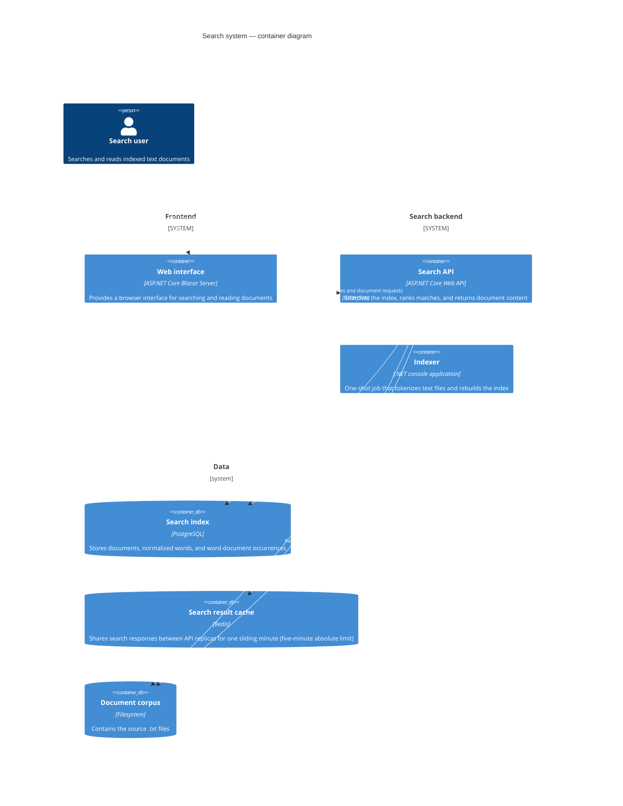

# Search system — C4 container diagram

```mermaid
%%{init: {"themeCSS": "rect[stroke-dasharray] { stroke: #ffffff !important; } rect[stroke-dasharray] ~ text { fill: #ffffff !important; } marker path { fill: #ffffff !important; stroke: #ffffff !important; }"} }%%
C4Container
    title Search system — container diagram

    Person(searchUser, "Search user", "Searches and reads indexed text documents")

    System_Boundary(frontend, "Frontend") {
        Container(webInterface, "Web interface", "ASP.NET Core Blazor Server", "Provides a browser interface for searching and reading documents")
    }

    System_Boundary(searchBackend, "Search backend") {
        Container(searchApi, "Search API", "ASP.NET Core Web API", "Searches the index, ranks matches, and returns document content")
        Container(indexer, "Indexer", ".NET console application", "One-shot job that tokenizes text files and rebuilds the index")
    }

    Boundary(data, "Data") {
        ContainerDb(searchIndex, "Search index", "PostgreSQL", "Stores documents, normalized words, and word-document occurrences")
        ContainerDb(searchCache, "Search result cache", "Redis", "Shares search responses between API replicas for one sliding minute (five-minute absolute limit)")
        ContainerDb(documentCorpus, "Document corpus", "Filesystem", "Contains the source .txt files")
    }

    Rel_D(searchUser, webInterface, "Uses", "HTTP in the local setup")
    Rel_D(webInterface, searchApi, "Sends searches and document requests", "HTTP/JSON")

    Rel_D(searchApi, searchIndex, "Reads the inverted index", "SQL / Npgsql")
    Rel_D(searchApi, searchCache, "Reads and writes search results", "Redis protocol")
    Rel_D(searchApi, documentCorpus, "Reads source text for case-sensitive search and viewing")
    Rel_D(indexer, documentCorpus, "Recursively reads .txt files")
    Rel_D(indexer, searchIndex, "Recreates and writes the index", "SQL / Npgsql")

    UpdateRelStyle(searchUser, webInterface, $textColor="#ffffff", $lineColor="#ffffff")
    UpdateRelStyle(webInterface, searchApi, $textColor="#ffffff", $lineColor="#ffffff")
    UpdateRelStyle(searchApi, searchIndex, $textColor="#ffffff", $lineColor="#ffffff")
    UpdateRelStyle(searchApi, searchCache, $textColor="#ffffff", $lineColor="#ffffff")
    UpdateRelStyle(searchApi, documentCorpus, $textColor="#ffffff", $lineColor="#ffffff")
    UpdateRelStyle(indexer, documentCorpus, $textColor="#ffffff", $lineColor="#ffffff")
    UpdateRelStyle(indexer, searchIndex, $textColor="#ffffff", $lineColor="#ffffff")

    UpdateElementStyle(frontend, $fontColor="#ffffff", $borderColor="#ffffff")
    UpdateElementStyle(searchBackend, $fontColor="#ffffff", $borderColor="#ffffff")
    UpdateElementStyle(data, $fontColor="#ffffff", $borderColor="#ffffff")

```
